# ADK MCP OAuth Architecture

This document describes the architecture of the Weather MCP Server with OAuth integration for Google Cloud Gemini Enterprise.

## Table of Contents

- [Overview](#overview)
- [Components](#components)
- [Development Architecture](#development-architecture)
- [Production Architecture](#production-architecture)
- [OAuth Flow Details](#oauth-flow-details)
- [Sequence Diagrams](#sequence-diagrams)

---

## Overview

This system demonstrates how to build an ADK (Agent Development Kit) agent that uses a remote MCP (Model Context Protocol) server with OAuth2 authentication, supporting both local development and production deployment to Google Cloud Gemini Enterprise.

**Key Feature:** The agent uses **dual-mode authentication** that automatically switches between:

- **Development Mode**: OAuth2Auth with client credentials (browser-based OAuth flow)
- **Production Mode**: Token retrieval from Gemini Enterprise context via header_provider

### Key Technologies

- **ADK (Agent Development Kit)**: Framework for building AI agents
- **MCP (Model Context Protocol)**: Protocol for tool/resource integration
- **FastMCP**: Python framework for building MCP servers
- **Google OAuth 2.0**: User authentication and authorization
- **Vertex AI Gemini Enterprise**: Production deployment platform
- **Cloud Run**: Serverless container hosting

---

## Components

### High-Level Component Diagram

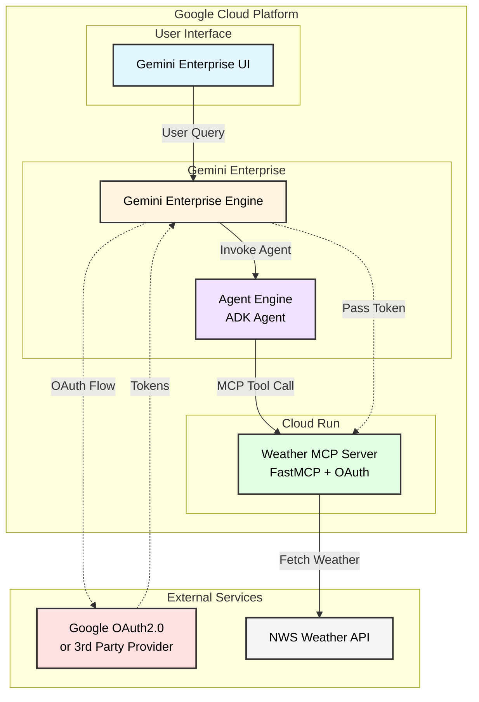

### Component Descriptions

| Component                    | Technology        | Purpose                                              | Location              |
| ---------------------------- | ----------------- | ---------------------------------------------------- | --------------------- |
| **Gemini Enterprise UI**     | Web UI            | User interface for interacting with agents           | Cloud-hosted          |
| **Gemini Enterprise Engine** | Vertex AI         | Orchestrates agents, handles OAuth, manages sessions | `global` or region    |
| **Agent Engine (ADK Agent)** | Python + ADK      | AI agent with LLM and MCP tool integration           | Deployed to Vertex AI |
| **Weather MCP Server**       | FastMCP + FastAPI | Provides weather tools via MCP protocol              | Cloud Run             |
| **Google OAuth 2.0**         | OAuth 2.0         | User authentication and authorization                | Google-managed        |
| **NWS Weather API**          | REST API          | National Weather Service data source                 | External              |

---

## Development Architecture

### Local Development Setup

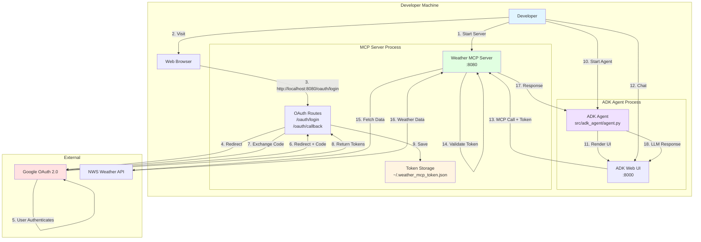

### Development OAuth Flow

**Redirect URI:** `http://localhost:8080/oauth/callback`

**Environment Configuration:**

```bash
ENVIRONMENT=development
USE_PRODUCTION_REDIRECT=false
OAUTH_REDIRECT_URI_LOCAL=http://localhost:8080/oauth/callback
```

---

## Production Architecture

### Gemini Enterprise Deployment

```mermaid
graph TB
    USER[User]

    subgraph "Google Cloud Platform"
        UI[Gemini Enterprise UI<br/>Web Interface]

        subgraph "Gemini Enterprise"
            AS[Gemini Enterprise Engine]

            subgraph "Agent Components"
                RE[Agent Engine<br/>ADK Agent Deployed]
                AUTH_CONFIG[Authorization Config<br/>OAuth Client Credentials]
            end
        end

        subgraph "Cloud Run"
            MCP_SERVER[Weather MCP Server<br/>FastMCP Service]

            subgraph "MCP Endpoints"
                MCP_ENDPOINT[/mcp Endpoint<br/>SSE/HTTP Transport]
                TOOLS[Weather Tools<br/>get_forecast<br/>get_alerts<br/>get_forecast_by_city]
            end
        end
    end

    subgraph "External Services"
        GOOGLE_OAUTH[Google OAuth 2.0<br/>accounts.google.com]
        NWS[National Weather Service<br/>api.weather.gov]
    end

    USER -->|1. Query| UI
    UI -->|2. Route to Agent| AS
    AS -->|3. Check Auth| AUTH_CONFIG
    AS -.->|4. OAuth Flow<br/>if needed| GOOGLE_OAUTH
    GOOGLE_OAUTH -.->|5. Redirect to<br/>vertexaisearch.cloud.google.com| AS
    AS -->|6. Invoke with Token| RE
    RE -->|7. MCP Tool Call<br/>+ Auth Header| MCP_ENDPOINT
    MCP_ENDPOINT -->|8. Validate Token| MCP_ENDPOINT
    MCP_ENDPOINT -->|9. Execute Tool| TOOLS
    TOOLS -->|10. API Request| NWS
    NWS -->|11. Weather Data| TOOLS
    TOOLS -->|12. MCP Response| RE
    RE -->|13. LLM Processing| RE
    RE -->|14. Answer| AS
    AS -->|15. Display| UI
    UI -->|16. Show Result| USER

    style USER fill:#e1f5ff
    style UI fill:#fff4e1
    style AS fill:#ffe1e1
    style RE fill:#f0e1ff
    style MCP_SERVER fill:#e1ffe1
    style GOOGLE_OAUTH fill:#ffe1e1
    style NWS fill:#f5f5f5
```

### Production OAuth Flow

**Redirect URI:** `https://vertexaisearch.cloud.google.com/oauth-redirect`

**Environment Configuration:**

```bash
ENVIRONMENT=production
USE_PRODUCTION_REDIRECT=true
OAUTH_REDIRECT_URI_PROD=https://vertexaisearch.cloud.google.com/oauth-redirect
```

---

## OAuth Flow Details

### Development vs Production Comparison

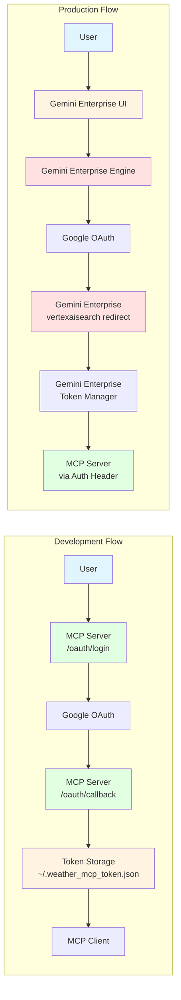

### Key Differences

| Aspect                | Development                               | Production                                               |
| --------------------- | ----------------------------------------- | -------------------------------------------------------- |
| **OAuth Handler**     | MCP Server                                | Gemini Enterprise                                        |
| **Redirect URI**      | `http://localhost:8080/oauth/callback`    | `https://vertexaisearch.cloud.google.com/oauth-redirect` |
| **Token Storage**     | File system (`~/.weather_mcp_token.json`) | Gemini Enterprise managed                                |
| **Token Delivery**    | Loaded from file                          | Passed via HTTP headers                                  |
| **OAuth Routes Used** | `/oauth/login`, `/oauth/callback`         | Not used (Gemini Enterprise handles)                     |

---

## Sequence Diagrams

### Production OAuth & Tool Call Flow

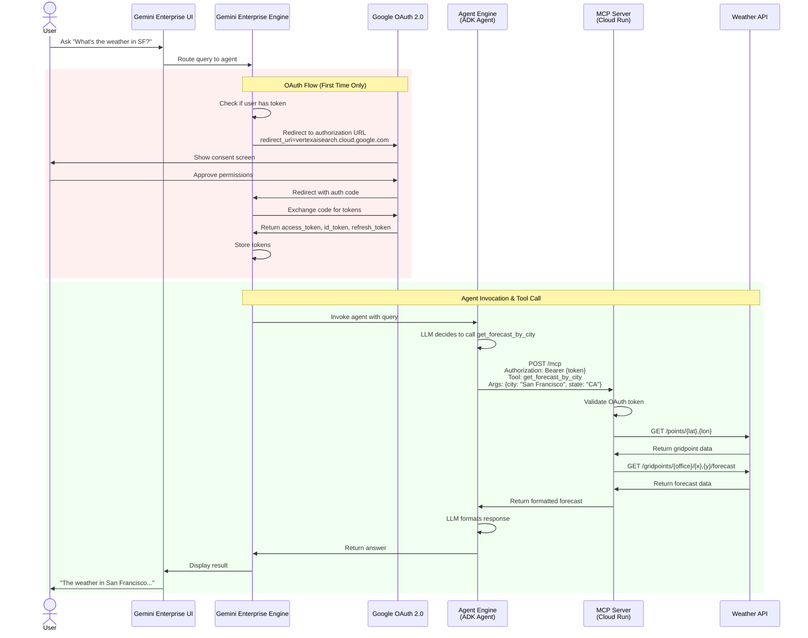

### Development Local Testing Flow

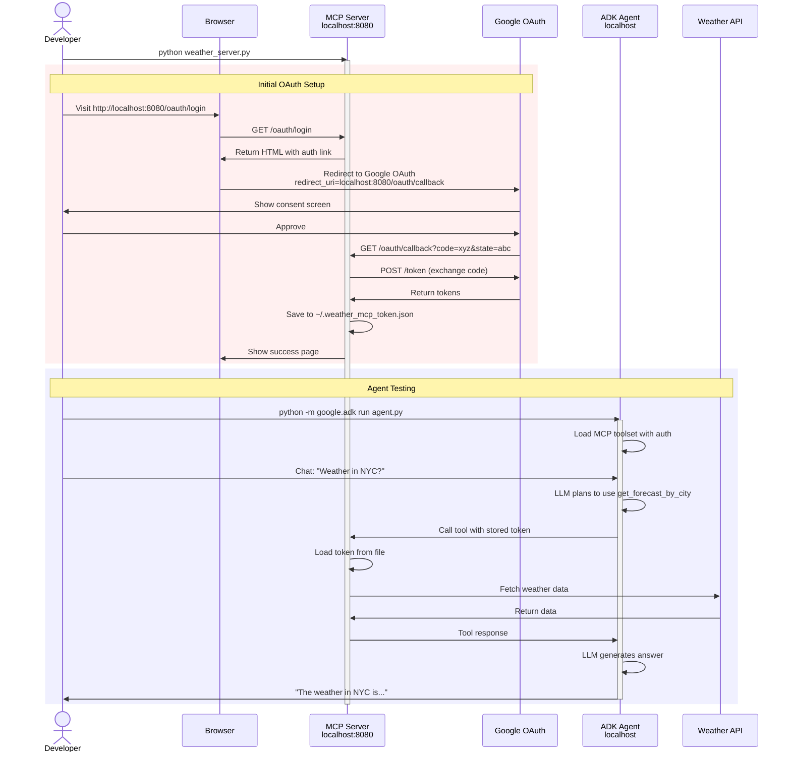

### Gemini Enterprise Registration Flow

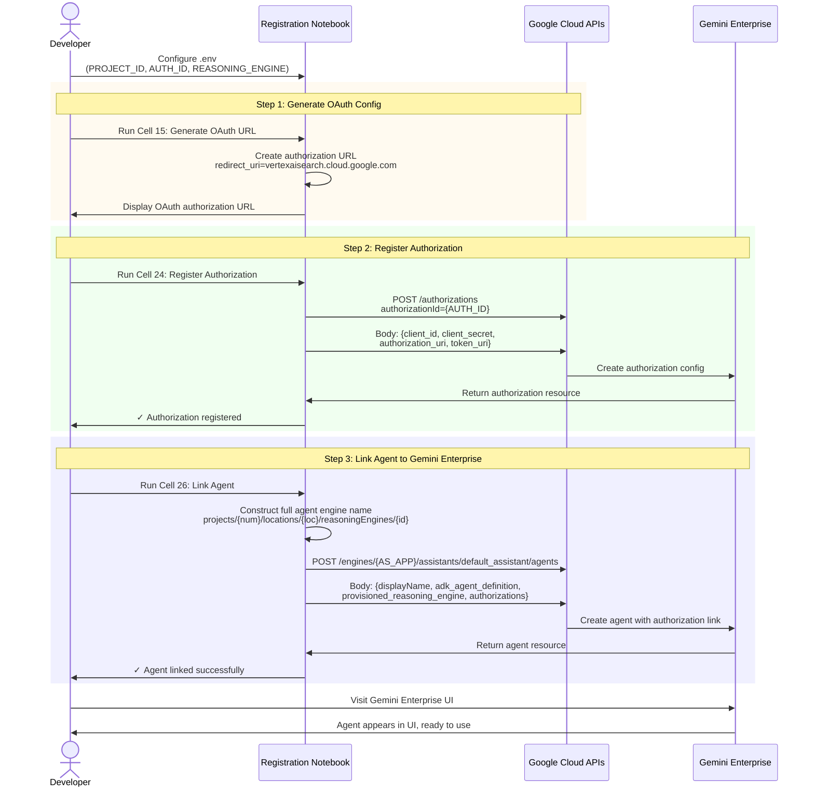

---

## Component Details

### ADK Agent (Agent Engine)

**File:** `src/adk_agent/agent.py`

The agent supports **dual-mode authentication** that automatically switches based on the `ENVIRONMENT` variable:

#### Development Mode (Local Testing)

```python
# Configuration for local development
environment = "development"

auth_scheme = OAuth2(
    flows=OAuthFlows(
        authorizationCode=OAuthFlowAuthorizationCode(
            authorizationUrl="https://accounts.google.com/o/oauth2/auth",
            tokenUrl="https://oauth2.googleapis.com/token",
            scopes={"openid": "Authenticate user identity", "email": "Access user's email address", "profile": "Access user's basic profile information"},
        )
    )
)

auth_credential = AuthCredential(
    auth_type=AuthCredentialTypes.OAUTH2,
    oauth2=OAuth2Auth(
        client_id=os.getenv("GOOGLE_CLIENT_ID"),
        client_secret=os.getenv("GOOGLE_CLIENT_SECRET"),
        redirect_uri="http://127.0.0.1:8000/dev-ui/",
    ),
)

root_agent = LlmAgent(
    model="gemini-2.5-flash",
    tools=[
        McpToolset(
            connection_params=StreamableHTTPConnectionParams(url=mcp_url),
            auth_scheme=auth_scheme,
            auth_credential=auth_credential,
        )
    ],
)
```

**How it works:**

- Uses `auth_scheme` and `auth_credential` parameters
- Triggers browser-based OAuth flow on first MCP tool call
- ADK manages token storage and refresh automatically

#### Production Mode (Gemini Enterprise)

```python
# Configuration for Gemini Enterprise deployment
environment = "production"
auth_id = os.getenv("AUTH_ID")


def get_auth_header_provider(auth_id: str):
    """Retrieves OAuth token from Gemini Enterprise context."""

    def header_provider(readonly_context) -> dict[str, str]:
        try:
            credential_service = readonly_context.session.state.get("credential_service")
            if credential_service:
                token = credential_service.get_credential(auth_id)
                if token and hasattr(token, "access_token"):
                    return {"Authorization": f"Bearer {token.access_token}"}
        except Exception as e:
            print(f"Error retrieving token: {e}")
        return {}

    return header_provider


root_agent = LlmAgent(
    model="gemini-2.5-flash",
    tools=[
        McpToolset(
            connection_params=StreamableHTTPConnectionParams(url=mcp_url),
            header_provider=get_auth_header_provider(auth_id),
        )
    ],
)
```

**How it works:**

- Uses `header_provider` function instead of auth_scheme/auth_credential
- Retrieves pre-authorized token from Gemini Enterprise context
- User completes OAuth in Gemini Enterprise UI (one-time setup)
- Token is injected into MCP requests via Authorization header

**Responsibilities:**

- Define LLM agent with instructions
- Configure MCP toolset with appropriate authentication method
- Connect to remote MCP server
- Process user queries and invoke tools

### Weather MCP Server

**File:** `src/mcp_servers/weather_mcp_server/weather_server.py`

```python
# OAuth Configuration
oauth_config = OAuthConfig(
    client_id=oauth_settings.google_client_id,
    client_secret=oauth_settings.google_client_secret,
    redirect_uri=oauth_settings.oauth_redirect_uri_local,
    redirect_uri_prod=oauth_settings.oauth_redirect_uri_prod,
    use_prod_redirect=oauth_settings.use_production_redirect,
)

# MCP Server with Tools
mcp = FastMCP(
    name="weather MCP server",
    instructions="A weather server protected by Google OAuth.",
)


@mcp.tool()
async def get_forecast(latitude: float, longitude: float) -> str:
    """Get weather forecast for coordinates"""


@mcp.tool()
async def get_alerts(state: str) -> str:
    """Get weather alerts for a US state"""


@mcp.tool()
async def get_forecast_by_city(city: str, state: str) -> str:
    """Get weather forecast by city and state"""
```

**Responsibilities:**

- Provide MCP protocol endpoints
- Handle OAuth routes (development mode)
- Implement weather tool functions
- Validate OAuth tokens
- Call external weather APIs

### OAuth Helper

**File:** `src/mcp_servers/weather_mcp_server/oauth_helper.py`

**Responsibilities:**

- Generate OAuth authorization URLs
- Exchange authorization codes for tokens
- Store and load tokens securely
- Refresh expired tokens
- Handle CSRF protection with state parameter

---

## Data Flow

### Tool Invocation Data Flow

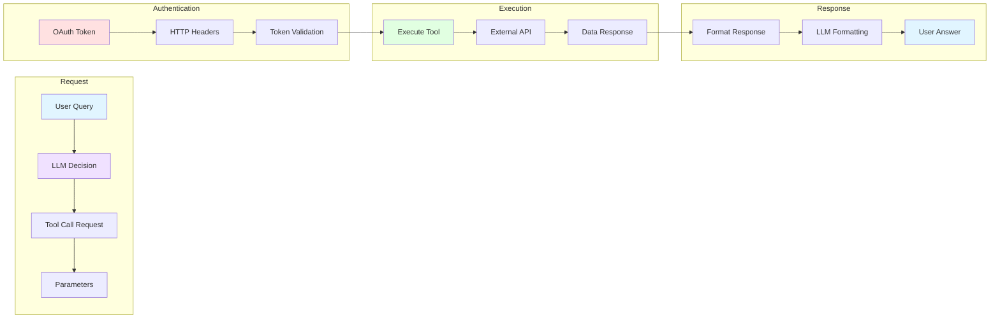

### Token Lifecycle

```mermaid
stateDiagram-v2
    [*] --> NoToken: User First Visit
    NoToken --> AuthFlow: Trigger OAuth
    AuthFlow --> ValidToken: Auth Success
    ValidToken --> ValidToken: Token Valid
    ValidToken --> Expired: Time Passes
    Expired --> RefreshFlow: Auto Refresh
    RefreshFlow --> ValidToken: Refresh Success
    RefreshFlow --> AuthFlow: Refresh Failed
    ValidToken --> Revoked: User Revokes
    Revoked --> AuthFlow: Re-authenticate
    AuthFlow --> [*]: Auth Failed

    note right of AuthFlow
        Development: MCP Server handles
        Production: Gemini Enterprise handles
    end note

    note right of RefreshFlow
        Uses refresh_token
        Automatic in both modes
    end note
```

---

## Security Architecture

### Security Layers

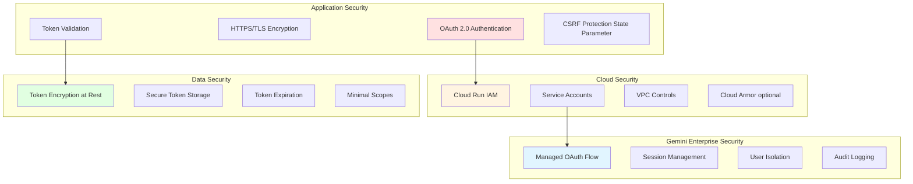

### OAuth Scopes & Permissions

| Scope                                                     | Purpose                    | Required For          |
| --------------------------------------------------------- | -------------------------- | --------------------- |
| `openid`                                                  | User identity              | Authentication        |
| `email`                                                   | User email address         | User identification   |
| `profile`                                                 | User profile info          | Display name, avatar  |
| `https://www.googleapis.com/auth/drive.metadata.readonly` | Drive metadata (optional)  | If accessing Drive    |
| `https://www.googleapis.com/auth/calendar.readonly`       | Calendar read (optional)   | If accessing Calendar |
| `https://www.googleapis.com/auth/bigquery`                | BigQuery access (optional) | If accessing BigQuery |

---

## Deployment Architecture

### Development Environment

```
┌─────────────────────────────────────┐
│     Developer Machine               │
│                                     │
│  ┌──────────────────────────────┐  │
│  │  Terminal 1                  │  │
│  │  python weather_server.py    │  │
│  │  → localhost:8080            │  │
│  └──────────────────────────────┘  │
│                                     │
│  ┌──────────────────────────────┐  │
│  │  Terminal 2                  │  │
│  │  python -m google.adk run... │  │
│  │  → localhost:8000            │  │
│  └──────────────────────────────┘  │
│                                     │
│  ┌──────────────────────────────┐  │
│  │  Browser                     │  │
│  │  → localhost:8000/dev-ui/    │  │
│  └──────────────────────────────┘  │
└─────────────────────────────────────┘
```

### Production Environment

```
┌──────────────────────────────────────────────────────────┐
│                    Google Cloud                          │
│                                                          │
│  ┌────────────────────────────────────────────────────┐ │
│  │              Vertex AI Gemini Enterprise                  │ │
│  │                                                    │ │
│  │  ┌──────────────────────────────────────────────┐ │ │
│  │  │  Gemini Enterprise UI (Web Interface)              │ │ │
│  │  │  → vertexaisearch.cloud.google.com          │ │ │
│  │  └──────────────────────────────────────────────┘ │ │
│  │                                                    │ │
│  │  ┌──────────────────────────────────────────────┐ │ │
│  │  │  Agent Engine (ADK Agent Deployed)      │ │ │
│  │  │  → Vertex AI Agent Engines API          │ │ │
│  │  └──────────────────────────────────────────────┘ │ │
│  │                                                    │ │
│  │  ┌──────────────────────────────────────────────┐ │ │
│  │  │  Authorization Store                        │ │ │
│  │  │  → OAuth Client Credentials                 │ │ │
│  │  └──────────────────────────────────────────────┘ │ │
│  └────────────────────────────────────────────────────┘ │
│                                                          │
│  ┌────────────────────────────────────────────────────┐ │
│  │              Cloud Run Service                     │ │
│  │                                                    │ │
│  │  ┌──────────────────────────────────────────────┐ │ │
│  │  │  Weather MCP Server Container              │ │ │
│  │  │  → weather-mcp-server-oauth.run.app        │ │ │
│  │  │  → /mcp endpoint (SSE or HTTP)             │ │ │
│  │  └──────────────────────────────────────────────┘ │ │
│  └────────────────────────────────────────────────────┘ │
│                                                          │
└──────────────────────────────────────────────────────────┘
```

---

## Network Flow

### Production Network Diagram

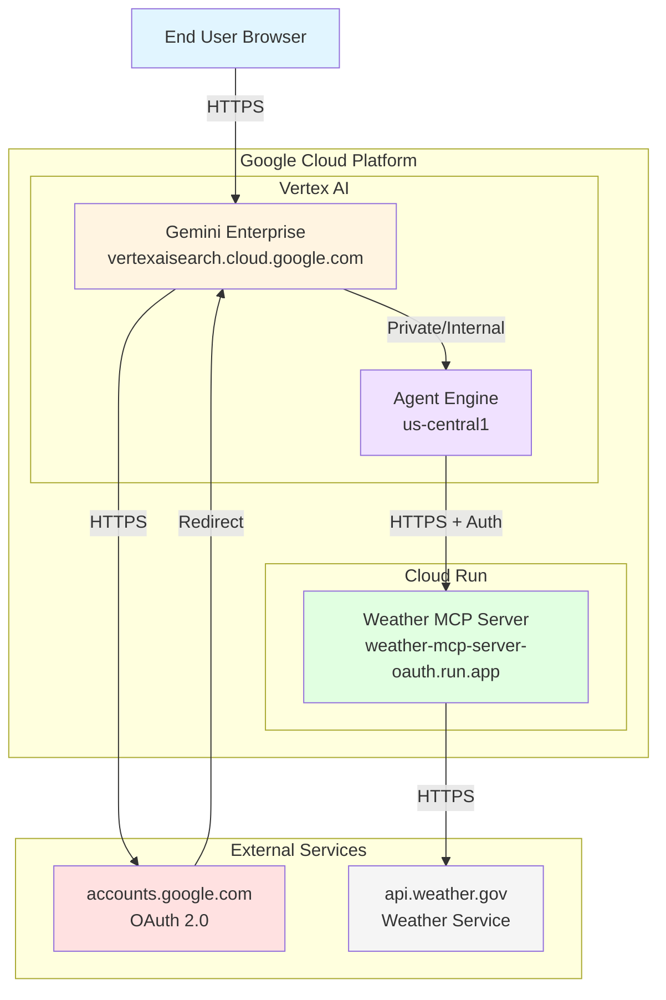

---

## Troubleshooting Guide

### Common Issues Flow

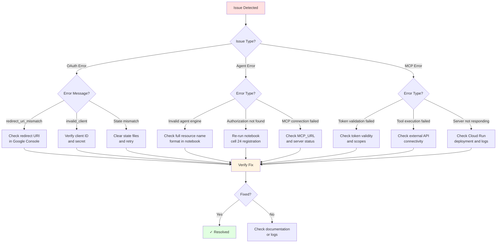

---

## References

- [ADK Documentation](https://github.com/google/adk)
- [Model Context Protocol](https://modelcontextprotocol.io/)
- [FastMCP Framework](https://github.com/jlowin/fastmcp)
- [Google OAuth 2.0](https://developers.google.com/identity/protocols/oauth2)
- [Vertex AI Agent Builder](https://cloud.google.com/generative-ai-app-builder/docs/agent-intro)
- [National Weather Service API](https://www.weather.gov/documentation/services-web-api)

---

## License

Copyright 2025 Google LLC - Licensed under Apache 2.0
