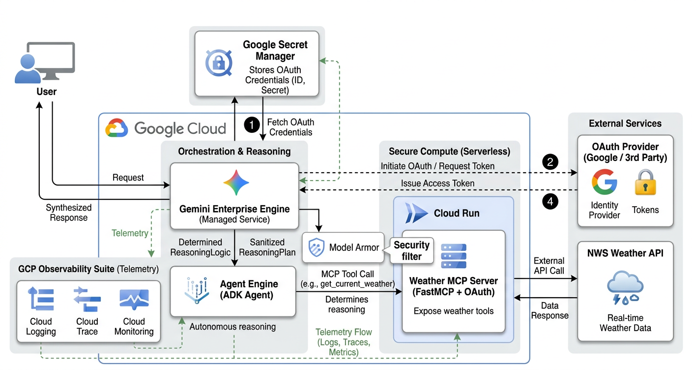
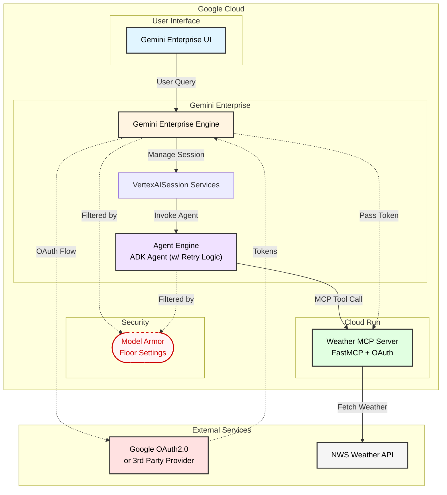

# Gemini Enterprise with ADK Agent for Secured Remote MCP Services

Complete guide for setting up an ADK agent with dual-mode OAuth authentication to access MCP (Model Context Protocol) services.

## Table of Contents
- [What This Project Does](#what-this-project-does)
- [Architecture & Components](#architecture--components)
- [Authentication & Security](#authentication--security)
- [Quick Start](#quick-start)
- [Deployment](#deployment)
- [Environment Variables Reference](#environment-variables-reference)
- [Troubleshooting](#troubleshooting)

## What This Project Does

The Gemini Enterprise Weather Agent is a cloud-native generative AI system deployed on Google Cloud. It leverages the Gemini Enterprise Engine and an ADK Agent to interpret natural language weather queries. By communicating securely with a custom FastMCP Weather Server hosted on Cloud Run, the agent fetches real-time meteorological data from the National Weather Service (NWS) API and delivers conversational insights back to the user.

---


This project demonstrates how to build an ADK agent that:

1. **Uses OAuth 2.0 authentication** to access protected MCP servers
2. **Automatically switches** between development and production authentication modes
3. **Handles OAuth flows differently** for local testing vs. Gemini Enterprise deployment
4. **Calls MCP tools** (weather forecasts) with authenticated requests

### Authentication Architecture

**Development Mode (Local Testing):**
```
User → ADK Web UI → Agent (OAuth2Auth) → Google OAuth → Token → MCP Server → Weather API
```
- Uses `auth_scheme` and `auth_credential` to trigger OAuth flow
- ADK manages token storage and refresh automatically

**Production Mode (Gemini Enterprise):**
```
User → Gemini Enterprise UI → Agent (header_provider) → Context Token → MCP Server → Weather API
```
- `McpToolset` is created with `header_provider=mcp_header_provider` and **no** `auth_scheme`
- Omitting `auth_scheme` ensures `_credentials_manager = None` in `MCPTool`, so the credential check is skipped and `header_provider` is called directly on every request
- `mcp_header_provider` reads the OAuth token from `session.state` keyed by `AUTH_ID`
- Token is injected into MCP requests via `Authorization: Bearer` header

The agent **automatically selects** the correct mode based on the `ENVIRONMENT` variable (`"development"` → dev mode, anything else → production mode).

---
---
## Architecture & Components

* **Gemini Enterprise Engine & UI**: Handles user interactions, intent recognition, and dynamic token-passing.
* **VertexAISession Services**: Manages user context, conversation history, and state persistence natively within Google Cloud.
* **ADK Agent**: The reasoning engine that decides when and how to invoke the Weather MCP server. It incorporates robust **Gemini model retry logic** to gracefully handle transient API errors, rate limits, and timeouts.
* **Weather MCP Server (Cloud Run)**: A FastMCP-based microservice that exposes weather-fetching tools and handles API requests to the NWS.
* **Identity Provider**: Manages OAuth 2.0 authentication for secure tool execution.
* **Observability (Agent Engine)**: Cloud Logging, Monitoring, and Tracing are natively enabled for the Agent Engine, providing complete visibility into execution logs, latency metrics, and distributed traces.

## High-Level Component Diagram



**Key Feature:** The agent automatically switches between development and production authentication modes based on the `ENVIRONMENT` variable:
- **Development**: OAuth2Auth with client credentials (browser-based OAuth flow)
- **Production**: Token retrieval from Gemini Enterprise context via `header_provider` — no `auth_scheme` is passed, ensuring the credential manager is bypassed entirely

**Use Cases:**
- Local testing with `adk web`
- Deployed agents on Vertex AI Agent Engine registered to Gemini Enterprise
---
## 🔐 Authentication & Security
This system features dynamic authentication switching based on the deployment environment to ensure developer velocity without compromising production security. Additionally, **Model Armor Floor Settings** are enabled project-wide to provide baseline security for all LLM interactions.

### Model Armor (Security Filtering)
Model Armor Floor Settings are configured at the project level to automatically inspect and block potential threats in both prompts and model responses. These are managed via [model_armor.tf](file:///usr/local/google/home/wangdave/remote_ws/projects/agent-solution-ops/deployment/terraform/model_armor.tf).

This baseline security provides:
- **Prompt Injection & Jailbreak Protection**: Detects and blocks adversarial attempts to bypass model constraints.
- **Harmful Content Filtering**: Enforces Responsible AI (RAI) filters for hate speech, harassment, sexually explicit content, and dangerous activities.
- **Malicious URI Detection**: Identifies and blocks links to known malicious sites.

For a detailed comparison of security enforcement options, see [MODEL_ARMOR_GUIDE.md](file:///usr/local/google/home/wangdave/remote_ws/projects/agent-solution-ops/MODEL_ARMOR_GUIDE.md).

### Environment-Based Switching
The `ENVIRONMENT` environment variable dictates the authentication flow:

**Development (`ENVIRONMENT=development`)**:
* Uses OAuth2Auth with client credentials.
* Triggers a browser-based OAuth flow for the developer to authenticate locally.

**Production (`ENVIRONMENT=production`)**:
* Uses server-to-server authentication (e.g., Google Cloud Service Accounts or headless OAuth).
* Tokens are securely passed from the Gemini Enterprise Engine to the MCP Server via authorization headers.
---
## Quick Start

### Prerequisites
- Python 3.12+
- Google Cloud Project with OAuth credentials
- uv package manager: [Install uv](https://docs.astral.sh/uv/getting-started/installation/)
- Project dependencies: `uv sync`

### 1. Clone and Setup

```bash
cp .env.example .env
```

### 2. Configure Google OAuth

Go to: https://console.cloud.google.com/apis/credentials

Click your OAuth 2.0 Client ID and add the redirect URIs below.

**For Development:**
```
http://127.0.0.1:8000/dev-ui/
http://localhost:8000/dev-ui/
```

**For Production (Gemini Enterprise):**
```
https://vertexaisearch.cloud.google.com/oauth-redirect
```

### 3. Set Environment Variables

Edit `src/adk_agent/.env`:

```bash
# Environment — set to 'development' for local testing.
# Any value other than 'development' activates production mode.
ENVIRONMENT=development

# Google Cloud
GOOGLE_CLOUD_PROJECT="your-project-id"
GOOGLE_CLOUD_LOCATION="us-central1"

# MCP Server URL (Cloud Run service URL + /mcp)
MCP_URL='https://your-mcp-server.run.app/mcp'

# OAuth Credentials (required for development mode only)
GOOGLE_CLIENT_ID='your-client-id'
GOOGLE_CLIENT_SECRET='your-client-secret'

# OAuth Redirect URIs
OAUTH_REDIRECT_URI_DEV='http://127.0.0.1:8000/dev-ui/'
OAUTH_REDIRECT_URI_PROD='https://vertexaisearch.cloud.google.com/oauth-redirect'

# Auth ID — must match the authorization registered in Gemini Enterprise
AUTH_ID='staging-weather-oauth-token'
```

### 4. Run Locally

```bash
uv run adk web src --port 8501 --reload_agents
```

Visit http://localhost:8501 and try: "What's the weather in Los Angeles?"

---
---
## Deployment

### Architecture

Deployment is split across two tools, each owning what it is best suited for:

| Layer | Tool | Resources |
|---|---|---|
| Infrastructure | Terraform | Cloud Run (MCP server), Artifact Registry, GCS buckets, IAM, Gemini Enterprise OAuth registration, **Model Armor Floor Settings** |
| Agent Engine | `deployment/deploy_agents.py` | Vertex AI Agent Engine (create + update) |

Terraform manages registration but **not** the Agent Engine source/env-vars. `deploy_agents.py` is the single owner of that resource — it creates it on first run and updates source code and env vars on every subsequent run. This avoids the split-ownership problem where two tools fight over env vars.

### CI/CD Pipeline
You would need to push the repository to GitHub to trigger the CI/CD pipeline.


Push to the configured branch triggers Cloud Build:

```
build MCP Docker image
        ↓
push image to Artifact Registry
        ↓
terraform apply  ──── Cloud Run MCP server
                 ──── GE OAuth authorization
                 ──── GE agent registration
        ↓
extract Cloud Run URL  (gcloud run services describe)
        ↓
deploy_agents.py  ──── Agent Engine (create or update)
                       env vars: MCP_URL, AUTH_ID, LOGS_BUCKET_NAME, telemetry
        ↓
load test  (staging only)
        ↓
trigger prod pipeline  (staging only)
```

### One-time Setup

This section is for someone setting up the project from scratch in their own Google Cloud environment. Follow the steps in order — each step is a prerequisite for the next.

#### Prerequisites

**Gemini Enterprise App & OAuth Credentials**

- You must create a Gemini Enterprise app and get its ID.
- You must set up OAuth 2.0 Web Client credentials and save the downloaded JSON file in Google Secret Manager as `client_secret`.

**Google Cloud Projects**

You need two or three Google Cloud projects:

| Variable | Purpose |
|---|---|
| `cicd_runner_project_id` | Hosts the Cloud Build triggers for PR checks and prod deploys. Can be the same as `prod_project_id`. |
| `staging_project_id` | Hosts the staging Cloud Run service, Agent Engine, and the staging CD pipeline trigger. |
| `prod_project_id` | Hosts the production Cloud Run service and Agent Engine. |

**Required caller permissions**

The identity running the initial `terraform apply` (your personal account or a bootstrap SA) needs the following on all three projects:

- `roles/owner` or `roles/editor` + `roles/resourcemanager.projectIamAdmin`

This is required because Terraform creates service accounts and grants them IAM roles. After the bootstrap, the CI/CD service accounts take over and manage their own permissions going forward.

**Tools**

- [Terraform](https://developer.hashicorp.com/terraform/install) >= 1.0.0
- [gcloud CLI](https://cloud.google.com/sdk/docs/install)
- [uv](https://docs.astral.sh/uv/getting-started/installation/)

#### Step 0 — Bootstrap Infrastructure Permissions

The identities running the CI/CD pipeline (both the default Cloud Build service account and the custom CD runner) need administrative permissions to manage project infrastructure across staging and production.

Run the provided setup script from your local machine (using an account with `roles/owner` or `roles/resourcemanager.projectIamAdmin`):

```bash
chmod +x deployment/scripts/setup_iam.sh
./deployment/scripts/setup_iam.sh <STAGING_PROJECT_ID> <PROD_PROJECT_ID> <STAGING_PROJECT_NUMBER>
```

Replace the placeholders with your actual project IDs and the project number of your **staging** project (where the CI/CD runners live). This step ensures that the first pipeline run has the authority to create service accounts, repositories, and Cloud Run services.

#### Step 1 — Create the Terraform state bucket

Terraform state is stored in GCS. The bucket must exist before running `terraform init`. Create it manually:

```bash
gcloud storage buckets create gs://dw-genai-dev-terraform-state \
  --project=dw-genai-dev \
  --location=us-central1 \
  --uniform-bucket-level-access
```

Then update `deployment/terraform/backend.tf` to match:

```hcl
terraform {
  backend "gcs" {
    bucket = "dw-genai-dev-terraform-state"
    prefix = "agent-solution-ops/prod"
  }
}
```

#### Step 2 — Configure `deployment/terraform/terraform.tfvars`

All Terraform configuration is defined via variables. Create a `terraform.tfvars` file in the `deployment/terraform` directory (this file is git-ignored) to set your project-specific values:

```hcl
prod_project_id        = "your-production-project-id"
staging_project_id     = "your-staging-project-id"
cicd_runner_project_id = "your-cicd-project-id"   # often same as prod
repository_owner       = "your-github-org-or-username"
repository_name        = "your-github-repo-name"
region                 = "us-central1"
ge_app_staging         = "your-ge-app-id-staging"
ge_app_prod            = "your-ge-app-id-prod"
```

Also configure the Cloud Build connection names to match what you'll create in Step 3:

```hcl
host_connection_name    = "your-cicd-project-connection-name"
staging_connection_name = "your-staging-project-connection-name"
```

To enable Gemini Enterprise OAuth registration, set the name of the Secret Manager secret that holds your OAuth client JSON:

```hcl
oauth_client_id_secret_name = "your-oauth-secret-name"
```

Leave it as `""` to skip GE registration during the initial bootstrap. You can enable it in a later apply once the infrastructure is stable.

#### Step 3 — Set up Cloud Build GitHub connections

Two Cloud Build GitHub connections are required — one in each project that runs a pipeline trigger:

| Project | Connection name (must match `variables.tf`) | Used by |
|---|---|---|
| `cicd_runner_project_id` | `host_connection_name` | PR checks + prod deploy trigger |
| `staging_project_id` | `staging_connection_name` | Staging CD trigger |

**To create each connection:**

You can manually set up the connections via the Google Cloud Console:
1. In the Google Cloud Console, go to **Cloud Build → Repositories** for the target project
2. Click **Create host connection**, choose GitHub, and follow the OAuth flow
3. Once the connection exists, link your repository to it

**Or, use the `agent-starter-pack` CLI (Recommended for new repositories):**
If you have cloned this repository and want to set it up for your own use, you can quickly configure the CI/CD pipeline and GitHub connections using the `agent-starter-pack` CLI:

```bash
uvx agent-starter-pack setup-cicd
```

For more details on this tool, see the [official documentation](https://googlecloudplatform.github.io/agent-starter-pack/cli/setup_cicd).

Alternatively, store a GitHub Personal Access Token (PAT) in Secret Manager and set `github_pat_secret_id` and `github_app_installation_id` in `variables.tf` — Terraform will create the connection automatically if `create_cb_connection = false`.

#### Step 4 — Configure Cloud Build substitutions

Edit the `substitutions` block at the bottom of `.cloudbuild/staging.yaml` and `.cloudbuild/deploy-to-prod.yaml`:

| Substitution | Description |
|---|---|
| `_STAGING_PROJECT_ID` | Google Cloud project ID for staging |
| `_PROD_PROJECT_ID` | Google Cloud project ID for production |
| `_REGION` | Google Cloud region (default: `us-central1`) |
| `_APP_SERVICE_ACCOUNT_STAGING` | Service account email for the staging Agent Engine (created by Terraform — set after first apply) |
| `_APP_SERVICE_ACCOUNT_PROD` | Service account email for the prod Agent Engine (created by Terraform — set after first apply) |
| `_AUTH_ID_STAGING` | GE authorization ID for staging (default: `staging-weather-oauth-token`) |
| `_AUTH_ID_PROD` | GE authorization ID for prod (default: `prod-weather-oauth-token`) |

The `AUTH_ID` values must match the `${each.key}-${local.auth_id}` pattern in `deployment/terraform/gemini_enterprise.tf`. For this project `local.auth_id = "weather-oauth-token"`, giving `staging-weather-oauth-token` and `prod-weather-oauth-token`. Use a project-specific suffix to avoid conflicts with other agents registered to the same GE app.

The service account emails follow the pattern `{project_name}-app@{project_id}.iam.gserviceaccount.com`. 

> **Note:** You can skip manual configuration here. When you run `terraform apply` in Step 5, Terraform will automatically configure these substitutions in the created Cloud Build triggers.

#### Step 5 — Bootstrap Terraform

Authenticate with your personal account (which has the required permissions from the Prerequisites section):

```bash
gcloud auth application-default login
```

Then run the initial apply:

```bash
cd deployment/terraform
terraform init
terraform apply
```

This creates all supporting infrastructure: service accounts, IAM bindings, Cloud Build triggers, Artifact Registry repositories, GCS buckets, and Cloud Run services.

> **Note:** The Agent Engine itself is not created here. It is created on the first successful Cloud Build run by `deploy_agents.py`.

#### Step 6 — Push to trigger CI/CD

The pipelines are triggered by branch pushes:

| Branch | Pipeline | File |
|---|---|---|
| `staging` | Build MCP image, Terraform (Cloud Run + OAuth), deploy Agent Engine, register to GE | `.cloudbuild/staging.yaml` |
| `main` | Deploy to production (requires manual approval in Cloud Build) | `.cloudbuild/deploy-to-prod.yaml` |

Push to `staging` to trigger the first automated deployment:

```bash
git push origin staging
```

---

#### Ongoing IAM changes

The CI/CD pipelines include their own IAM bindings as Terraform targets, so changes to `cicd_roles` in `variables.tf` are applied automatically on the next pipeline run — no manual intervention needed for own-project role changes.

Cross-project IAM grants (defined in `cicd_sa_deployment_required_roles`) still require a manual local `terraform apply` because the staging SA cannot grant itself roles in the prod project:

```bash
cd deployment/terraform
terraform apply -target=google_project_iam_member.staging_cicd_deployment_roles \
                -target=google_project_iam_member.other_projects_roles
```

#### Gemini Enterprise OAuth registration

GE OAuth authorization and agent registration are controlled by `oauth_client_id_secret_name` in `variables.tf`. Set it to the Secret Manager secret name that holds your OAuth client JSON (web app format):

```hcl
variable "oauth_client_id_secret_name" {
  default = "client_secret"
}
```

**For fresh setups:** the bootstrap `terraform apply` in Step 5 grants `roles/secretmanager.secretAccessor` to the staging CI/CD service account automatically (it is part of `cicd_roles`). No manual action is needed.

**For existing deployments** where `oauth_client_id_secret_name` was previously empty: setting it to a non-empty value causes Terraform to read the secret at plan time, before it can apply the new IAM role. This is a one-time bootstrapping problem. Break the deadlock with a manual grant:

```bash
gcloud secrets add-iam-policy-binding <SECRET_NAME> \
  --project=<STAGING_PROJECT_ID> \
  --member="serviceAccount:<PROJECT_NAME>-cd@<STAGING_PROJECT_ID>.iam.gserviceaccount.com" \
  --role="roles/secretmanager.secretAccessor"
```

The SA email follows the pattern `{project_name}-cd@{staging_project_id}.iam.gserviceaccount.com` (e.g. `agents-solution-ops-cd@dw-genai-dev.iam.gserviceaccount.com`). After this one-time grant, the pipeline takes over and manages the role via Terraform going forward.

---

#### Manual operations (outside CI/CD)

**Deploy agent manually:**

```bash
uv run deployment/deploy_agents.py
```

Runs `deployment/deploy_agents.py` directly. Useful for one-off deploys from a developer machine.

**Register to Gemini Enterprise manually:**

```bash
uvx agent-starter-pack@0.36.0 register-gemini-enterprise
```

Handled automatically by Terraform in CI/CD when `oauth_client_id_secret_name` is set. The Makefile target is available for manual registration or re-registration.

---
---
## Environment Variables Reference

### Agent (`src/adk_agent/.env`)

| Variable | Required | Description |
|---|---|---|
| `ENVIRONMENT` | No | `development` enables dev OAuth flow. Default: `deployment` (production mode). |
| `MCP_URL` | Yes | Full URL of the MCP server including `/mcp` path. |
| `AUTH_ID` | Yes | Gemini Enterprise authorization ID (e.g. `staging-weather-oauth-token`). |
| `GOOGLE_CLIENT_ID` | Dev only | OAuth client ID for browser-based flow. |
| `GOOGLE_CLIENT_SECRET` | Dev only | OAuth client secret for browser-based flow. |
| `GOOGLE_CLOUD_PROJECT` | No | Google Cloud project ID. |
| `GOOGLE_CLOUD_LOCATION` | No | Google Cloud region. Default: `us-central1`. |
| `OAUTH_REDIRECT_URI_DEV` | No | Dev redirect URI. Default: `http://127.0.0.1:8000/dev-ui/`. |
| `OAUTH_REDIRECT_URI_PROD` | No | Prod redirect URI. Default: `https://vertexaisearch.cloud.google.com/oauth-redirect`. |
| `DEBUG_CONTEXT` | No | Set to `true` to dump full session context to stderr on each MCP call. |
| `LOGS_BUCKET_NAME` | No | GCS bucket for artifact storage. Default: none (uses in-memory). |

### MCP Server (`src/mcp_servers/weather_mcp_server/.env`)

| Variable | Required | Description |
|---|---|---|
| `PROJECT_ID` | Yes | Google Cloud project ID. |
| `GOOGLE_CLIENT_ID` | Yes | OAuth client ID for MCP server OAuth middleware. |
| `GOOGLE_CLIENT_SECRET` | Yes | OAuth client secret. |
| `OAUTH_REDIRECT_URI_PROD` | No | Production redirect URI. |

---
---
## Troubleshooting

### Cloud Build fails with 403 downloading Python packages

**Symptom:**

```
× Failed to download `python-dotenv==1.2.1`
├─▶ Failed to fetch:
│   `https://us-python.pkg.dev/artifact-foundry-prod/ah-3p-staging-python/...`
╰─▶ HTTP status client error (403 Forbidden)
```

**Cause:**

On machines with a corporate Python package proxy (e.g., Google's internal Airlock), the system `pip.conf` sets the PyPI index URL to an internal Artifact Registry mirror:

```ini
# /etc/pip.conf — managed by Airlock
[global]
index-url = https://us-python.pkg.dev/artifact-foundry-prod/ah-3p-staging-python/simple/
```

`uv lock` reads this configuration and bakes the internal mirror URLs into `uv.lock`. Cloud Build, running outside the corporate network, cannot access those internal URLs.

**Fix:**

Pin the uv index to PyPI in `pyproject.toml` using the `[[tool.uv.index]]` table with `default = true`. This is the only form that overrides the system `pip.conf` index in uv (the `[tool.uv]` `index-url` key does not):

```toml
[[tool.uv.index]]
name = "pypi"
url = "https://pypi.org/simple"
default = true
```

After adding this, delete and regenerate the lockfile so all package URLs resolve to `files.pythonhosted.org`:

```bash
rm uv.lock
uv lock
git add pyproject.toml uv.lock
git commit -m "fix: pin uv index to PyPI to prevent corporate mirror URLs in lockfile"
```

This is already configured in `pyproject.toml` in this project.