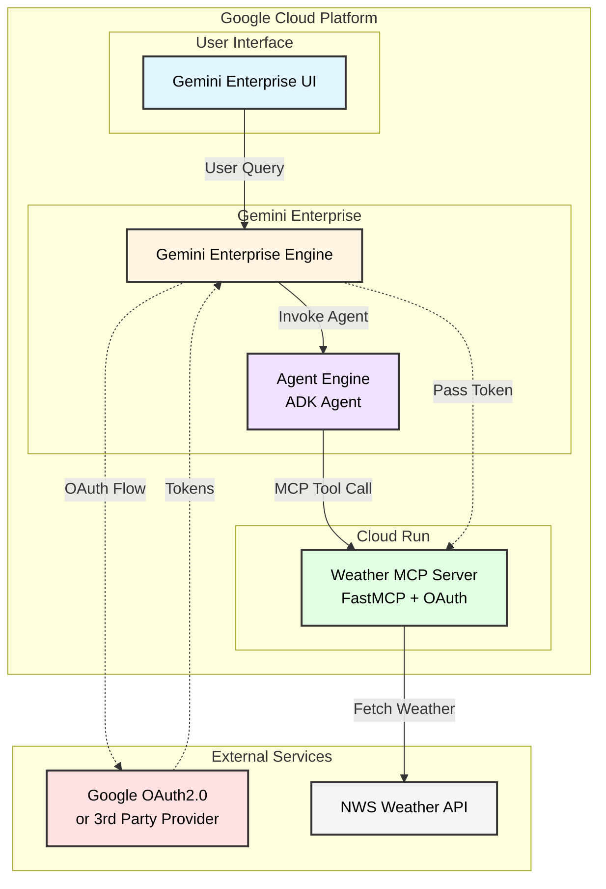

# ADK Weather Agent with OAuth Authentication

Complete guide for setting up an ADK agent with dual-mode OAuth authentication to access MCP (Model Context Protocol) weather services.

## High-Level Component Diagram



**Key Feature:** The agent automatically switches between development and production authentication modes based on the `ENVIRONMENT` variable:
- **Development**: OAuth2Auth with client credentials (browser-based OAuth flow)
- **Production**: Token retrieval from Gemini Enterprise context via `header_provider` — no `auth_scheme` is passed, ensuring the credential manager is bypassed entirely

**Use Cases:**
- Local testing with `adk web`
- Deployed agents on Vertex AI Agent Engine registered to Gemini Enterprise

---

## Quick Start

### Prerequisites
- Python 3.12+
- Google Cloud Project with OAuth credentials
- uv package manager: [Install uv](https://docs.astral.sh/uv/getting-started/installation/)
- Project dependencies: `uv sync`

### 1. Clone and Setup

```bash
cp src/adk_agent/.env.example src/adk_agent/.env
```

### 2. Configure Google OAuth

Go to: https://console.cloud.google.com/apis/credentials

Click your OAuth 2.0 Client ID and add the redirect URIs below.

**For Development:**
```
http://127.0.0.1:8000/dev-ui/
http://localhost:8000/dev-ui/
```

**For Production (Gemini Enterprise):**
```
https://vertexaisearch.cloud.google.com/oauth-redirect
```

### 3. Set Environment Variables

Edit `src/adk_agent/.env`:

```bash
# Environment — set to 'development' for local testing.
# Any value other than 'development' activates production mode.
ENVIRONMENT=development

# Google Cloud
GOOGLE_CLOUD_PROJECT="your-project-id"
GOOGLE_CLOUD_LOCATION="us-central1"

# MCP Server URL (Cloud Run service URL + /mcp)
MCP_URL='https://your-mcp-server.run.app/mcp'

# OAuth Credentials (required for development mode only)
GOOGLE_CLIENT_ID='your-client-id'
GOOGLE_CLIENT_SECRET='your-client-secret'

# OAuth Redirect URIs
OAUTH_REDIRECT_URI_DEV='http://127.0.0.1:8000/dev-ui/'
OAUTH_REDIRECT_URI_PROD='https://vertexaisearch.cloud.google.com/oauth-redirect'

# Auth ID — must match the authorization registered in Gemini Enterprise
AUTH_ID='staging-ui_oauth_token'
```

### 4. Run Locally

```bash
make playground
```

Visit http://localhost:8501 and try: "What's the weather in Los Angeles?"

---

## Deployment

### Architecture

Deployment is split across two tools, each owning what it is best suited for:

| Layer | Tool | Resources |
|---|---|---|
| Infrastructure | Terraform | Cloud Run (MCP server), Artifact Registry, GCS buckets, IAM, Gemini Enterprise OAuth registration |
| Agent Engine | `deployment/deploy_agents.py` | Vertex AI Agent Engine (create + update) |

Terraform manages registration but **not** the Agent Engine source/env-vars. `deploy_agents.py` is the single owner of that resource — it creates it on first run and updates source code and env vars on every subsequent run. This avoids the split-ownership problem where two tools fight over env vars.

### CI/CD Pipeline

Push to the configured branch triggers Cloud Build:

```
build MCP Docker image
        ↓
push image to Artifact Registry
        ↓
terraform apply  ──── Cloud Run MCP server
                 ──── GE OAuth authorization
                 ──── GE agent registration
        ↓
extract Cloud Run URL  (gcloud run services describe)
        ↓
deploy_agents.py  ──── Agent Engine (create or update)
                       env vars: MCP_URL, AUTH_ID, LOGS_BUCKET_NAME, telemetry
        ↓
load test  (staging only)
        ↓
trigger prod pipeline  (staging only)
```

### One-time Setup

#### 1. Configure `deployment/terraform/variables.tf`

All Terraform variables are stored as `default` values directly in `variables.tf` — no separate `.tfvars` file is needed (and `*.tfvars` is git-ignored anyway). Edit the placeholder defaults:

```hcl
variable "prod_project_id"        { default = "your-production-project-id" }
variable "staging_project_id"     { default = "your-staging-project-id" }
variable "cicd_runner_project_id" { default = "your-cicd-project-id" }
variable "repository_owner"       { default = "your-github-org-or-username" }
variable "ge_app_staging"         { default = "your-ge-app-id-staging" }
variable "ge_app_prod"            { default = "your-ge-app-id-prod" }
```

To enable Gemini Enterprise OAuth registration, set the name of the Secret Manager secret that holds your OAuth client JSON:

```hcl
variable "oauth_client_id_secret_name" { default = "client_secret" }
```

Leave it as `""` to skip GE registration (useful for initial infrastructure bootstrapping).

#### 2. Configure Cloud Build substitutions

Edit `.cloudbuild/staging.yaml` and `.cloudbuild/deploy-to-prod.yaml` substitutions:

| Substitution | Description |
|---|---|
| `_STAGING_PROJECT_ID` | GCP project ID for staging |
| `_PROD_PROJECT_ID` | GCP project ID for production |
| `_REGION` | GCP region (default: `us-central1`) |
| `_APP_SERVICE_ACCOUNT_STAGING` | Service account email for the staged Agent Engine |
| `_APP_SERVICE_ACCOUNT_PROD` | Service account email for the prod Agent Engine |
| `_AUTH_ID_STAGING` | GE authorization ID for staging (default: `staging-ui_oauth_token`) |
| `_AUTH_ID_PROD` | GE authorization ID for prod (default: `prod-ui_oauth_token`) |
| `_LOGS_BUCKET_NAME_STAGING` | GCS bucket for load test result export |

The `AUTH_ID` substitutions must match the `${each.key}-${local.auth_id}` pattern in `deployment/terraform/gemini_enterprise.tf` (default: `staging-ui_oauth_token` / `prod-ui_oauth_token`).

#### 3. Bootstrap Terraform (first time only)

```bash
cd deployment/terraform
terraform init
terraform apply
```

This creates all supporting infrastructure. The Agent Engine itself is created on the first Cloud Build run via `deploy_agents.py`.

#### 4. Manual agent deploy (outside CI/CD)

```bash
make deploy
```

This runs `src/adk_agent/app_utils/deploy.py` directly with CLI args. Useful for one-off deploys from a developer machine.

#### 5. Register to Gemini Enterprise (manual)

```bash
make register-gemini-enterprise
```

This is handled automatically by Terraform in CI/CD when `oauth_client_id_secret_name` is set, but the Makefile target is available for manual registration.

---

## What This Project Does

This project demonstrates how to build an ADK agent that:

1. **Uses OAuth 2.0 authentication** to access protected MCP servers
2. **Automatically switches** between development and production authentication modes
3. **Handles OAuth flows differently** for local testing vs. Gemini Enterprise deployment
4. **Calls MCP tools** (weather forecasts) with authenticated requests

### Authentication Architecture

**Development Mode (Local Testing):**
```
User → ADK Web UI → Agent (OAuth2Auth) → Google OAuth → Token → MCP Server → Weather API
```
- Uses `auth_scheme` and `auth_credential` to trigger OAuth flow
- ADK manages token storage and refresh automatically

**Production Mode (Gemini Enterprise):**
```
User → Gemini Enterprise UI → Agent (header_provider) → Context Token → MCP Server → Weather API
```
- `McpToolset` is created with `header_provider=mcp_header_provider` and **no** `auth_scheme`
- Omitting `auth_scheme` ensures `_credentials_manager = None` in `MCPTool`, so the credential check is skipped and `header_provider` is called directly on every request
- `mcp_header_provider` reads the OAuth token from `session.state` keyed by `AUTH_ID`
- Token is injected into MCP requests via `Authorization: Bearer` header

The agent **automatically selects** the correct mode based on the `ENVIRONMENT` variable (`"development"` → dev mode, anything else → production mode).

---

## Environment Variables Reference

### Agent (`src/adk_agent/.env`)

| Variable | Required | Description |
|---|---|---|
| `ENVIRONMENT` | No | `development` enables dev OAuth flow. Default: `deployment` (production mode). |
| `MCP_URL` | Yes | Full URL of the MCP server including `/mcp` path. |
| `AUTH_ID` | Yes | Gemini Enterprise authorization ID (e.g. `staging-ui_oauth_token`). |
| `GOOGLE_CLIENT_ID` | Dev only | OAuth client ID for browser-based flow. |
| `GOOGLE_CLIENT_SECRET` | Dev only | OAuth client secret for browser-based flow. |
| `GOOGLE_CLOUD_PROJECT` | No | GCP project ID. |
| `GOOGLE_CLOUD_LOCATION` | No | GCP region. Default: `us-central1`. |
| `OAUTH_REDIRECT_URI_DEV` | No | Dev redirect URI. Default: `http://127.0.0.1:8000/dev-ui/`. |
| `OAUTH_REDIRECT_URI_PROD` | No | Prod redirect URI. Default: `https://vertexaisearch.cloud.google.com/oauth-redirect`. |
| `DEBUG_CONTEXT` | No | Set to `true` to dump full session context to stderr on each MCP call. |
| `LOGS_BUCKET_NAME` | No | GCS bucket for artifact storage. Default: none (uses in-memory). |

### MCP Server (`src/mcp_servers/weather_mcp_server/.env`)

| Variable | Required | Description |
|---|---|---|
| `PROJECT_ID` | Yes | GCP project ID. |
| `GOOGLE_CLIENT_ID` | Yes | OAuth client ID for MCP server OAuth middleware. |
| `GOOGLE_CLIENT_SECRET` | Yes | OAuth client secret. |
| `OAUTH_REDIRECT_URI_PROD` | No | Production redirect URI. |
