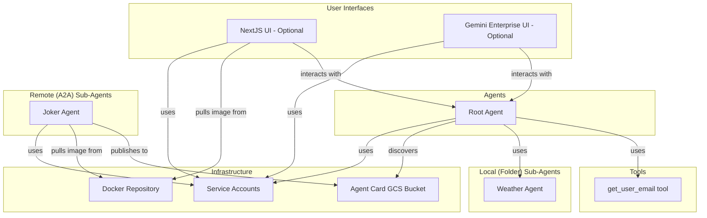

# tmpl-a2a-agents-example


- [tmpl-a2a-agents-example](#tmpl-a2a-agents-example)
- [1. Overview](#1-overview)
- [2. Prerequisites](#2-prerequisites)
  - [2.1 Development Environment](#21-development-environment)
  - [2.2 Optional Feature Dependencies](#22-optional-feature-dependencies)
    - [2.2.1 - (Optional) Agent Engine NextJS UI (Agent Hub)](#221---optional-agent-engine-nextjs-ui-agent-hub)
    - [2.2.2 - (Optional) Gemini Enterprise Agent Registration/Integration](#222---optional-gemini-enterprise-agent-registrationintegration)
- [3. Using this Example Solution Bundle](#3-using-this-example-solution-bundle)
  - [3.1. Opening the Repo in a Dev Container](#31-opening-the-repo-in-a-dev-container)
  - [3.2. Logging into Google Cloud SDK for CLI Commands and Application Default Credentials](#32-logging-into-google-cloud-sdk-for-cli-commands-and-application-default-credentials)
  - [3.3. Create and Deploying the Base Terraform Assets](#33-create-and-deploying-the-base-terraform-assets)
- [4. Post-Deploying Repository-level Operations](#4-post-deploying-repository-level-operations)
  - [4.1. Updating Infrastructure Resources](#41-updating-infrastructure-resources)
  - [4.2. Upgrading Terraform Modules](#42-upgrading-terraform-modules)
  - [4.3. Synchronizing Changes to Terraform Config (*config.tfvars*)](#43-synchronizing-changes-to-terraform-config-configtfvars)
    - [4.3.1. Persisting Changes to config.tfvars](#431-persisting-changes-to-configtfvars)
    - [4.3.2. Fetching/Updating Changes to config.tfvars](#432-fetchingupdating-changes-to-configtfvars)
      - [Refreshing Changes to config.tfvars](#refreshing-changes-to-configtfvars)
      - [Deploying config change relates resource updates](#deploying-config-change-relates-resource-updates)
  - [4.4. Destroying Infrastructure Modules](#44-destroying-infrastructure-modules)
  - [4.5. Resetting Terraform, Python, and NodeJS Services State](#45-resetting-terraform-python-and-nodejs-services-state)
  - [4.6. Visualizing the High-level Module Dependencies](#46-visualizing-the-high-level-module-dependencies)
- [5. License](#5-license)

# 1. Overview

The following diagram provides a comprehensive overview of the system architecture, including all agents, UIs, tools, and infrastructure components, and their relationships.



This diagram illustrates the overall system architecture. Users can interact with the system through either the `NextJS UI` or the `Gemini Enterprise UI`. Both UIs communicate with the `Root Agent`, which acts as the central orchestrator. The `Root Agent` has a `get_user_email` tool and discovers folder-based sub-agents, such as the `Weather Agent` automatically.  It also discovers remote agents, such as the `Joker Agent`, by reading their agent cards from a GCS bucket. The `Joker Agent` publishes its agent card to this bucket. All services are containerized and their images are stored in a central `Docker Repository`. Each component in the system uses a dedicated `Service Account` for secure access control.


# 2. Prerequisites

## 2.1 Development Environment

To use this base template's full capabilities, you must complete the following:

  - Have a (preferrably Debian-based) Linux Development environment
  - [Install the Google Cloud SDK and gcloud CLI tool](https://docs.cloud.google.com/sdk/docs/install)
  - Have Visual Studio Code (VSCode) IDE with the following Extensions enabled:
    - [Dev Containers](https://marketplace.visualstudio.com/items?itemName=ms-vscode-remote.remote-containers)
    - (if remote dev) Remote - SSH
    - (if remote dev) Remote - Tunnels
    - (if remote dev) Remote Development
    - (if remote dev) Remote Explorer
  - Have a Google Cloud Platform (GCP) Project, or [create a new one](https://developers.google.com/workspace/guides/create-project).

## 2.2 Optional Feature Dependencies

To use some optional features in this repository, see the related section below for prerequisites.

### 2.2.1 - (Optional) Agent Engine NextJS UI (Agent Hub)

This repository includes a NextJS UI that deploys to Cloud Run and provides a UI to interacting with an Agent deployed to Agent Engine.


 - Configure your GCP Project's OAuth Consent Screen.  See [Configuring OAuth Consent Screen](/docs/assets/oauth-consent/README.md)
 - Create OAuth Client Credentials and save the OAuth Client ID as a Secret in Secret Manager.  See [Creating OAuth Client Credentials](/docs/assets/oauth-creds/README.md)
 - Store the OAuth Client ID as a Secret in Secret Manager.  See [Creating OAuth Client ID as a Secret in Secret Manager](/docs/assets/oauth-client-id-secret/README.md)
 - Uncomment the Terraform resources in `iac/modules_4_nextjs_agent_engine_ui.tf`

### 2.2.2 - (Optional) Gemini Enterprise Agent Registration/Integration

This repository includes resources to integrate the Root agent deployed on Agent Engine with Gemini Enterprise.


 - Configure your GCP Project's OAuth Consent Screen.  See [Configuring OAuth Consent Screen](/docs/assets/oauth-consent/README.md)
 - Create OAuth Client Credentials and save the OAuth Client ID as a Secret in Secret Manager.  See [Creating OAuth Client Credentials](/docs/assets/oauth-creds/README.md)
 - Store the OAuth Client ID and OAuth Client Secret as Secrets in Secret Manager.  See [Creating OAuth Client ID as a Secret in Secret Manager](/docs/assets/oauth-client-id-secret/README.md)
 - Create a Gemini Enterprise App, and add its ID to the `gemini_enterprise_app_id` input variable in `iac/config.tfvars` (any time after running `make init` during onboarding)
 - Uncomment the Terraform resources in `iac/modules_7_gemini_enterprise_root_agent.tf`

# 3. Using this Example Solution Bundle


## 3.1. Opening the Repo in a Dev Container

Let's start by opening the repo with your VSCode development environment.

Upon opening the repo, you should receive a pop-up noticing that this repository supports devcontainers.  Select **Reopen in Container** to launch the new development container environment.


The first time creation of the development container might take up to 5 minutes.  You can watch the progress by clicking the show logs in the dev container progress widget.

Future logins will benefit from re-using the container and occur almost as quickly as standard SSH sessions.

## 3.2. Logging into Google Cloud SDK for CLI Commands and Application Default Credentials

Now that we're inside the dev container environment, we need to authenticate your gcloud environment.

This is accomplished by executing a single command:

```
cd iac && make login
```

## 3.3. Create and Deploying the Base Terraform Assets

Now, deploy the bsae terraform assets by using special make targets.

From the **iac** directory:
```
make init
```

This will initiaze a new onboarding configuration, or fetch an existing one if someone has already done the first time Terraform deployment.  After make init, a file **config.tfvars** will be created in the **iac** directory where you can customize any elements before deploying the assets to the GCP environment.

If this is your first time onboarding this project, you'll be prompted a few questions, and the shared Terraform state will be stored on a new Google Cloud Storage (GCS) bucket named based on your application namespace.  This ensures additional team members can onboard and have a shared view of Terraform state when preparing or making changes.

Here is valid example output **config.tfvars**:

```
# GCP Application Project
app_namespace               = "hellow-v001"
project_id                  = "prj-advcomp1"
region                      = "us-central1"
agents_region               = "global"
bq_region                   = "us"
env_sas                     = []
test_user_emails            = []
oauth_client_id_secret_name = "OAUTH_CLIENT_ID"
```

 - The important constraints on the parameters above are:
   - \<app_namespace\> will be prefixed to all resources as a namespace.  It MUST:
        - Be < 15 characters to prevent added suffixes from exceeding certain GCP component name limits, dedicated service account names.
        - Cannot contain "google" or any variation include "g00gl3".
        - May only contain lowercase letters, numbers, and hyphens, and must begin with a letter and end with a letter or number.

In most cases the generated file won't need editting.

Now go ahead and deploy the assets:

From the **iac** directory:
```
make plan
make happen
```

The deployment should completed within 5 minutes.


# 4. Post-Deploying Repository-level Operations

## 4.1. Updating Infrastructure Resources

When adding or updating Terraform resources, use **make plan** and **make happen** to push changes into your GCP infrastructure, similar to the initial deployment.

From within the **iac** directory:

```
make plan
```

After successfully executing the above:

```
make happen
```

Once executed your changes will be live.


## 4.2. Upgrading Terraform Modules

When adding or updating Terraform resources, use **make upgrade**, followed by **make plan** and **make happen** to upgrade modules, and push any related changes into your GCP infrastructure, similar to the initial deployment and updating resources.

From within the **iac** directory:
 - Upgrade the modules
 ```
 make upgrade
 ```
 - Push any upgrade-related changes
```
make plan
make happen
```

Any changes will be live once complete.


## 4.3. Synchronizing Changes to Terraform Config (*config.tfvars*)

If you happen to make changes to config.tfvars additional actions are required to persist the changes, and refresh them with other team members.

### 4.3.1. Persisting Changes to config.tfvars

From within the **iac** directory:
 ```
 make config-push
 ```

### 4.3.2. Fetching/Updating Changes to config.tfvars

#### Refreshing Changes to config.tfvars

From within the **iac** directory:
 ```
 make config-pull
 ```

#### Deploying config change relates resource updates

From within the **iac** directory:
```
make plan
make happen
```

All will be synchronized after the above commands finish.


## 4.4. Destroying Infrastructure Modules

When finished with the deployment, use **make disappear** to remove resources from your GCP infrastructure.

From within the **iac** directory:
```
make disappear
```

Once executed your changes will be live.


## 4.5. Resetting Terraform, Python, and NodeJS Services State

If you ever need to wipe the terraform state (without removing any resources) and all venvs, node modules, etc. and re-onboard into the environment, use this process to hard reset.

From within the **iac** directory:
```
make clean
```

The above command will clean all local state for Terraform, Python, NodeJS, etc.

To re-onboard:

From within the **iac** directory:
```
make plan
make happen
```

Once finished your environment will be reset.

## 4.6. Visualizing the High-level Module Dependencies

For complete solutions, visualizing Terraform resources isn't very helpful when there are several hundreds of low-level resources.  Most important abstractions should be custom modules.  Use the **make mod-graph** command to create a visualization of only custom modules, as shown in the image below.


From within the **iac** directory:
```
make mod-graph
```

The output will be stored in the **docs** directory.

Still, if you wish to see a full graph of all low-level Terraform resources, you can use **make graph**

From within the **iac** directory:
```
make graph
```
The output will be stored in the **docs** directory.


# 5. License

This project is licensed under the standard Google Apache-2.0 license.
